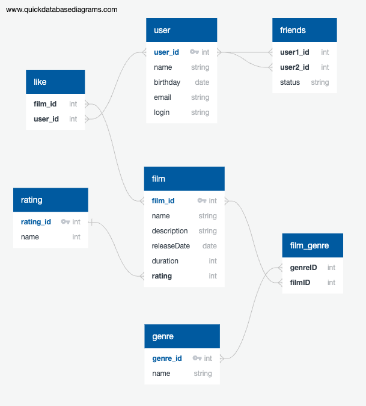

# java-filmorate

1) таблица film, у тебя поле rating ссылается на таблицу rating, так что по сути это внешний ключ. Тут правильнее использовать нейминг rating_id. В таблице rating можно использовать id или rating_id (как у тебя сейчас)
2) лайки у нас по сути имеют связь (many-many). У одного пользователя может быть много лайков у фильмов, и у одного фильма может быть много лайков от пользователя. Поэтому мы нормализуем связь через доп. таблицу, которая связывает пользователей и лайки. И эта таблица должна быть 1-to-many. Поэтому правильнее поставить связь 1-to-many между film / like, user / like
3) У поля name в таблице rating указан тип integer. Кажется что некорректно, так как там будут вещи типа "PG", "PG-13" итп
4) У поля status в таблице friends не понятно почему тип string. Лучше наверное использовать bool 0/1, что по смыслу подтвержденная / неподтвержденная 
5) В таблице film_genre у тебя поля называются filmID, genreID. Лучше везде использовать одинаковый нейминг, например snake_case (film_id, genre_id, user_id)
6) По заданию еще нужно написать типовые запросы к БД - у тебя нету.
